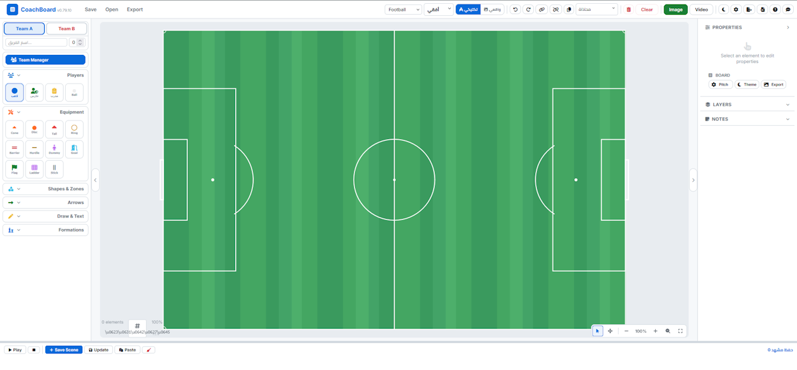
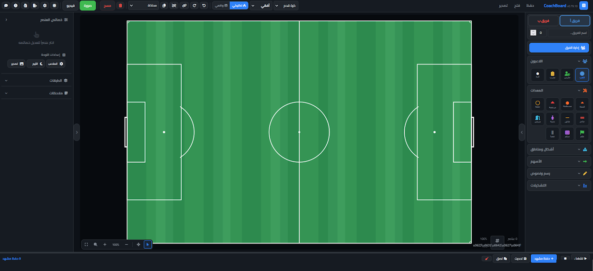

# ⚽ CoachBoard

A modern tactical board for Football, Futsal and Beach Soccer coaches.

CoachBoard is a web application that allows coaches to create tactical boards, training sessions, exercises and match analysis quickly and easily.

🌍 **Website:** https://coachboard.site.je/

---

# Screenshots

## English Interface



## Arabic Interface



---

# Features

- Football Tactical Board
- Futsal Tactical Board
- Beach Soccer Tactical Board
- Players
- Balls
- Cones
- Goals
- Arrows
- Drawing Tools
- Session Builder
- SVG Graphics
- Responsive Interface
- Dark Mode
- Light Mode
- Multi-language Support
- Offline Support

---

# Technologies

- HTML5
- CSS3
- JavaScript
- SVG
- Canvas

---

# Current Version

**v0.79.10**

---

# Installation

Clone the repository

```bash
git clone https://github.com/KinanCodeaz/CoachBoard.git
```

Open:

```
index.html
```

No installation required.

---

# Roadmap

- Animation System
- PDF Export
- Video Export
- AI Tactical Assistant
- Cloud Save
- Team Management

---

# Author

**Abdelilah Benbrahim**

Football Coach • Futsal Coach • Beach Soccer Coach

Morocco 🇲🇦